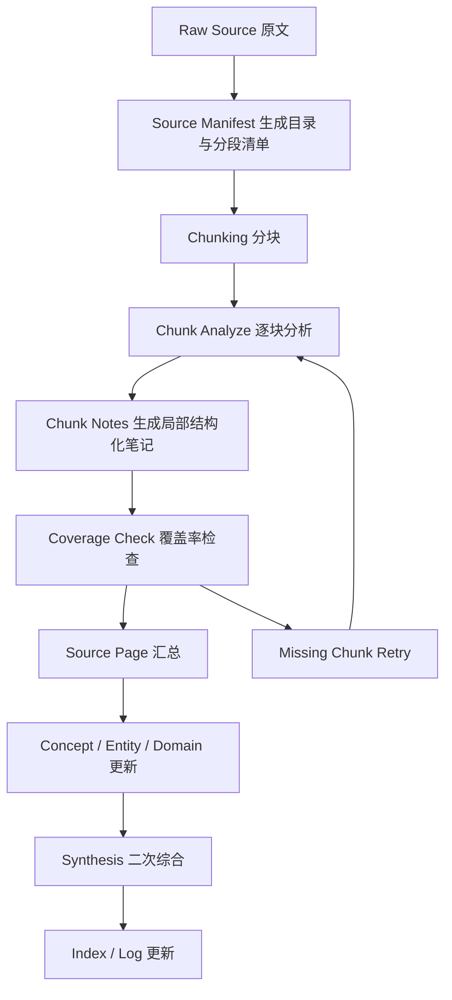

# 长文 ingest 问题与解法

## 背景

在 Piki 的知识库设计里，长文 ingest 不能依赖 agent 一次性“读完整篇再总结”。文章一旦很长，系统就容易只处理前面一部分，或者只抓住高显著内容，最终生成一个看起来完成、实际覆盖不全的结果。

这个问题的本质不是模型不够聪明，而是产品流程缺少对“全文是否被完整处理”的显式管理。

## 现象

长文 ingest 容易出现这些表现：

- 直接把七万字中文文章交给 agent，agent 实际只关注前面或高显著部分
- 没有 source manifest，系统不知道全文到底由多少段组成
- 没有 chunk 级别的 ingest log，无法判断哪些段处理过、哪些段遗漏
- 没有 coverage check，agent 可能“以为自己读完了”
- 直接生成 wiki 页面，中间分析过程不可审计
- 没有多轮 synthesis，长文最后只被压缩成一小段摘要

## 核心判断

Piki 需要解决的不是“怎么把长文塞进上下文”，而是：

> 如何让系统明确知道全文由哪些部分组成，哪些已经读过，哪些已经写入，哪些被遗漏，哪些需要二次综合。

因此，长文 ingest 应该被设计成一个可验证、可追踪、可重试的编译流水线。

## 推荐流水线

这个流程的关键不是“分块”本身，而是每一步都有中间产物，系统不用依赖 agent 的短时上下文记忆。

## 方案拆解

### 1. Source Manifest

每篇长文 ingest 前，先生成一个 manifest，记录：

- 来源标题
- 原始路径
- 全文字数
- chunk 总数
- 每个 chunk 的字符范围
- 每个 chunk 的 hash
- 每个 chunk 的处理状态

作用：

- 系统明确知道“全文到底有多少部分”
- 后续可以对缺失 chunk 做重试
- source 变化后可以增量更新，而不是整篇重算

### 2. Chunk Analyze

不要让长文直接生成最终 wiki 页面，而是先逐块生成中间 note。

建议每个 chunk note 至少包含：

- 局部摘要
- 关键主张
- 概念
- 实体
- 证据
- 候选 wiki 更新页
- 不确定点

作用：

- 确保每段真的被读过
- 让后续 source compile 和 review 有可追踪依据
- 降低长文在一次总结里被静默压缩的风险

### 3. Coverage Check

这是长文 ingest 最关键的一层保护。

建议检查：

- manifest 中所有 chunk 是否都完成
- 每个 chunk 是否都有 note 文件
- note 是否过短或为空
- 每个 note 是否至少抽取了摘要、主张、概念等基本结构
- source page 是否真正引用了所有 chunk note
- log 是否记录了每个 chunk 的处理状态

作用：

- 避免“假读完”
- 能把 ingest 状态区分为完整、部分完成、失败、待复查

### 4. 多级总结

不要从原文直接生成最终 summary。

推荐三层：

1. `chunk notes`
2. `section summaries`
3. `source page`

这样做的好处是：

- 长文先被拆成局部可理解单元
- 再按章节回收
- 最后才做整篇综合

这比“一次总结整篇文章”更稳，也更容易审计和修正。

### 5. 用文件状态记忆，而不是上下文记忆

不要让 agent 执行这种任务：

> 请读完这篇七万字文章并写入 Wiki。

而应该改成类似流程：

1. 先生成 manifest
2. 逐个处理 chunk
3. 为每个 chunk 写 note
4. 跑 coverage check
5. 缺块重试
6. 汇总生成 source page
7. 再更新 concepts、entities、domains、synthesis

这样 agent 丢失上下文也没关系，因为状态都写在文件里。

## 对 Piki 的产品启发

这类问题说明 Piki 的 ingest 不能被设计成“单步动作”，而应该是“受控流水线”。

产品层面建议补齐这些对象：

- source manifest
- chunk notes
- coverage report
- ingest queue
- update queue
- retry 机制
- review queue

这些中间对象的意义不是增加复杂度，而是让长期记忆的形成过程可验证、可回看、可维护。

## 可以落到产品里的最小结论

如果只提炼成最小可执行方案，可以先做这四项：

1. 为长文 source 自动生成 manifest
2. 按固定大小切 chunk，并产出 chunk notes
3. 在 compile 前执行 coverage check
4. 只有 coverage 通过后，才允许生成正式 source page

做到这一步，Piki 就已经从“靠上下文一次总结”进入“可验证长文编译”阶段了。
