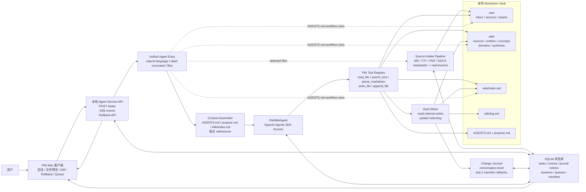

# Piki MVP 功能全景

## 0. 产品定位

Piki 是一个面向个人的 **本地优先知识库产品** ，目标是帮助用户更可靠地“记住”和更自然地“回忆”。

它的核心不是把资料简单丢进一个 RAG 系统，而是基于  **LLM Wiki 模式** ，将用户的原始资料持续编译成一个：

* 可维护的个人记忆系统
* 可浏览的 Markdown Wiki
* 可追溯的知识网络
* 可追踪、可增长、可回滚的长期记忆库

MVP 阶段的重点不是做复杂协作、云同步、多模态全量导入或重型 research automation，而是先跑通：

1. 个人知识库内核
2. Agent 维护流程
3. 基础检索与回忆
4. 变更记录与回退机制
5. 简易 Mac 客户端交互
6. 基于 OpenAI Agents SDK 的本地 agent 承载层
7. 本地 API 与统一 agent 任务入口

---

# 1. MVP 总体能力地图

| 能力层                      | 核心问题                 | MVP 要支持什么                                                                |
| --------------------------- | ------------------------ | ----------------------------------------------------------------------------- |
| 个人记忆目标层              | 这个知识库为什么存在？   | 定义 vault 目的、记忆范围、回忆偏好、维护偏好和使用节奏                       |
| Vault 内核层                | 数据如何组织？           | 建立 raw + wiki 双层结构，保留原始资料，同时生成可读、可维护的 Wiki           |
| Agent 入口层                | 用户如何驱动系统？       | 支持自然语言、slash command 和附件；统一进入 agent，上下文由 `AGENTS.md` 约束 |
| Capture / Ingest 层         | 资料如何进入知识库？     | 支持 inbox、文件导入、source normalization、hash 去重、ingest queue           |
| Analyze / Generate 编译层   | 资料如何变成知识？       | 先分析、再生成，直接写入 Wiki，同时保留冲突和不确定性标记                     |
| Change Journal / Rollback 层 | 写坏了怎么办？           | 记录对话级 journal entry，支持最近两条 raw/wiki 修改对话按 hash 校验回退       |
| 回忆与检索层                | 用户如何问回自己的记忆？ | 支持 index-first query、关键词检索、中文召回、wikilink 扩展、引用回答         |
| 维护与健康检查层            | 知识库如何长期不腐烂？   | 支持 lint、孤儿页、断链、重复概念、过期内容、知识缺口检查                     |
| 本地 API 层                 | 多入口如何共享能力？     | Mac 客户端、CLI、agent 对话都调用同一套本地 task API                          |
| Agent 承载层                | MVP 用什么来跑 agent？   | 基于 OpenAI Agents SDK 搭建本地 Agent Service；SDK 负责 agent loop、工具调用、流式事件和模型接入，Piki 负责 vault 写入边界 |
| Mac 客户端层                | 普通用户如何使用？       | 提供 vault picker、inbox、queue、rollback、explore、ask、maintenance 等基础界面 |

---

# 1.1 MVP 架构图

这个架构的核心是：Piki 客户端不直接操作 wiki，也不直接依赖 OpenAI Agents SDK 的原始事件；客户端只和本地 Agent Service 通信。Agent Service 不再先把自然语言分流成独立任务类型，而是把 `AGENTS.md`、`purpose.md`、`wiki/index.md` 和受控工具统一交给 agent。带文件的请求先进入 source intake；纯自然语言请求进入统一 agent loop。Agent 根据 `AGENTS.md` 自主执行 query、ingest、lint 等 workflow。vault 内除 `AGENTS.md` 外都允许 agent 读写；`AGENTS.md` 仅可读；vault 外只允许读取用户明确提供的来源路径，绝不开放写入。Change journal 是对话级的：只有某条对话真实修改了 `raw/` 或 `wiki/`，才形成一条 journal entry，记录这条对话内全部 raw/wiki 写入的写前/写后 hash 和内容快照，并支持最近两条修改对话回退。

---

# 2. 个人记忆目标层

这一层定义每个 vault 的长期目标，让 Piki 不只是一个文件夹，而是一个有明确用途的个人记忆系统。

| 功能           | 说明                                                                                  | MVP 价值                                     |
| -------------- | ------------------------------------------------------------------------------------- | -------------------------------------------- |
| `purpose.md` | 每个 vault 都有一个目的文件，描述这个记忆库为什么存在                                 | 让 agent 理解这个 vault 的长期方向           |
| 记忆范围声明   | 记录用户长期关心的领域，例如 AI、产品、投资、心理学、健康、写作、项目、个人原则和决策 | 避免知识库无限扩张，帮助系统判断什么值得记住 |
| 回忆偏好声明   | 描述用户希望系统如何回答，例如结构化、简洁、需要引用、需要反例、需要关联旧经验        | 提高问答结果的一致性                         |
| 维护偏好声明   | 描述 agent 写入风格、日志粒度、冲突标记和回退偏好                                    | 控制自动化维护方式                           |
| 使用节奏声明   | 记录每日 capture、每周 ingest、每月 synthesis/lint 等推荐节奏                         | 帮助用户形成长期使用习惯                     |

---

# 3. Vault 内核层

Piki 的核心数据结构是一个本地 Markdown vault。它应该让用户随时能打开、阅读、迁移，而不是被锁死在某个 App 里。

## 3.1 Vault 基础结构

| 目录 / 文件       | 作用                                                             |
| ----------------- | ---------------------------------------------------------------- |
| `raw/`          | 原始资料层，只读、不可变，用于保存真实来源                       |
| `raw/inbox/`    | 新资料暂存区，支持待处理网页、Markdown、PDF、笔记、聊天记录等    |
| `raw/sources/`  | 已确认进入知识库的原始来源                                       |
| `raw/assets/`   | 图片、附件、截图、下载资源                                       |
| `wiki/`         | LLM 维护的编译知识层                                             |
| `wiki/index.md` | 知识库索引，query 前优先读取                                     |
| `wiki/log.md`   | append-only 操作日志，记录 ingest、query、lint 等操作 |
| `AGENTS.md`     | agent 维护协议，定义目录、模板、链接和操作规则                   |

## 3.2 Wiki 编译层结构

| 目录                | 内容类型                           | 示例                                     |
| ------------------- | ---------------------------------- | ---------------------------------------- |
| `wiki/sources/`   | 每个来源对应的结构化 source page   | 某篇文章、某个 PDF、某段聊天记录         |
| `wiki/concepts/`  | 概念、方法、模型、观点、框架       | LLM Wiki、Agent Memory、Product Strategy |
| `wiki/entities/`  | 人物、公司、工具、地点、项目、产品 | OpenAI、Notion、某个项目、某个客户       |
| `wiki/domains/`   | 领域地图和持续演化的领域综述       | AI 产品、投资研究、健康管理              |
| `wiki/synthesis/` | 跨来源综合、比较、判断、回答沉淀   | “我对个人知识库产品的长期判断”         |

---

# 4. Agent 入口层

Agent 入口层解决的问题是：用户不需要理解底层目录结构，也可以自然地让 Piki 完成知识库维护。

MVP 阶段这里不从零手写 agent runtime，而是基于 OpenAI Agents SDK 搭建本地 Agent Service。Piki 自己的 UI 负责提供更适合知识工作流的可视化外壳，把 agent 事件映射成结构化交互。

| 功能               | 说明                                                                                                                           | MVP 要求                     |
| ------------------ | ------------------------------------------------------------------------------------------------------------------------------ | ---------------------------- |
| 自然语言入口       | 用户可以直接说“把这篇文章收进知识库”“帮我回忆一下某个主题”“做一次健康检查”                                               | 支持常见知识库操作意图       |
| Slash command 入口 | 支持稳定命令，如 `/wiki:ingest`、`/wiki:compile`、`/wiki:query`、`/wiki:lint`、`/wiki:research` | 提供更可控、更稳定的操作方式 |
| 上下文装配         | 统一加载 `AGENTS.md`、`purpose.md`、`wiki/index.md`，并向 agent 暴露完整受控工具集                                             | 避免前置分流误判意图         |
| 变更记录           | 对话真实修改 `raw/` 或 `wiki/` 后记录 journal entry、diff、before/after hash 和回退状态                                      | 让用户知道系统改了哪些内容   |
| 入口复用           | CLI、API、Mac 客户端、agent 对话都调用同一套 task API 和工具策略                                                               | 避免不同入口行为不一致       |

## 4.1 MVP 中 OpenAI Agents SDK 的角色

| 能力 | 说明 |
| --- | --- |
| Agent loop | 负责推进对话、读取文档、调用本地工具和生成结果 |
| Function tools | 将 `read_file`、`search_text`、`parse_markdown`、`write_file`、`append_file` 等受控能力暴露给 agent |
| Streaming events | 将 SDK run / tool / final output 事件映射为 Piki task events |
| Structured output | 对 `IngestResult`、`LintResult` 等输出做结构约束 |
| Model endpoint | 通过 `OPENAI_API_KEY`、`OPENAI_BASE_URL`、`PIKI_AGENT_MODEL` 连接 OpenAI 或 OpenAI-compatible endpoint |
| 文档上下文入口 | 优先读取 `AGENTS.md`、`purpose.md`、`wiki/index.md`、产品文档和相关 source |
| 非目标 | 不替代 Piki 的 vault 写入规则、工具边界和回退策略 |

## 4.1.1 当前实现状态

| 状态 | 说明 |
| --- | --- |
| 已完成 | `openai-agents` 已安装，runner scaffold 可检测 SDK 是否可用 |
| 已完成 | 本地 API、SQLite task/event、SSE、query pipeline、source intake pipeline |
| 已完成 | `capture` 可将单文件规范化为 `raw/sources/*.md`，并维护 `system/source_manifest.json` |
| 已完成 | Ingest queue 支持批量入队、同步小批处理、失败记录、重试和取消 |
| 已完成 | Lint 支持 frontmatter、断链、孤儿页、重复标题、索引缺失、过期和知识缺口检查，并支持低风险 index/log 修复 |
| 待完成 | 配置 OpenAI-compatible endpoint 后执行 `Runner.run` smoke test |
| 待完成 | 将 Piki vault 工具注册为 SDK `function_tool` |
| 待完成 | 将 SDK streaming/tool/final output 映射为 Piki task events |
| 待完成 | 用 SDK agent 直接生成并写入真实 `ingest` 结果，同时记录对话级 journal entry |

## 4.2 Mac 客户端如何承载本地 Agent Service

MVP 分为开发期和产品期两种运行方式：

| 阶段 | 服务启动方式 | 客户端职责 |
| --- | --- | --- |
| 开发期 | 开发者手动执行 `uvicorn agent_service.app:app --host 127.0.0.1 --port 8000` | Mac 客户端连接 `127.0.0.1:8000`，执行 `/health`、`POST /tasks` 和 SSE 渲染 |
| 产品 MVP | Mac App 启动时检查 `127.0.0.1:8000`，无健康服务则拉起 App bundle 内的 `agent-service/piki-agent-service` | 管理本地服务生命周期、定期 health、异常提示或重启、退出时停止自己拉起的服务 |

固定端口是 MVP 默认策略。若端口被非 Piki 服务占用，客户端显示明确错误，不静默切换端口。Unix socket、动态端口、后台常驻 LaunchAgent 和完整配置迁移都后置。

| UI 区块 | MVP 要表现什么 |
| --- | --- |
| 会话区 | 消息流、状态、阶段性结论 |
| 状态区 | 当前 task 阶段、写入状态、最近 journal entry |
| 文件区 | source、wiki 页面、节目概览、摘要、转写全文预览 |
| 变更区 | diff、journal entry、最近两条修改对话回退入口 |
| 任务区 | ingest、转写、维护检查等任务进度 |

## 4.3 MVP Command 示例

| Command             | 作用                                       |
| ------------------- | ------------------------------------------ |
| `/wiki:ingest`    | 将 inbox 或指定 source 加入处理队列        |
| `/wiki:compile`   | 对资料执行 Analyze → Generate 编译流程    |
| `/wiki:query`     | 基于现有 wiki 回答问题                     |
| `/wiki:lint`      | 检查知识库结构和内容健康度                 |
| `/wiki:research`  | 可作为后续扩展能力，MVP 可弱化或半手动支持 |

---

# 5. Capture / Source Intake / Ingest 层

这一层负责把资料可靠地放进知识库，但不急着把所有内容都变成长期记忆。产品上需要区分三个动作：

| 动作 | 作用 | 是否更新 `wiki/` |
| --- | --- | --- |
| Capture | 接收用户上传或指定的文件 | 否 |
| Source Intake / Normalization | 将 MD/TXT/PDF/DOCX 规范化为 `raw/sources/*.md` | 否 |
| Ingest / Compile | 读取 canonical source，分析并写入 wiki 更新 | 直接写入，并记录对话级 journal entry |

| 功能                 | 说明                                                        | MVP 要求                                                      |
| -------------------- | ----------------------------------------------------------- | ------------------------------------------------------------- |
| 文件导入             | 支持 Markdown、纯文本、PDF、DOCX                            | PPTX、表格、音频、视频、图片 OCR 可后置                       |
| Inbox capture        | 用户可以快速把资料丢进 `raw/inbox/`                       | 不要求立刻处理                                                |
| Source normalization | 将资料整理为可追踪 source，记录标题、路径、来源、日期、格式 | 方便后续引用和追溯                                            |
| Source hashing       | 为来源计算 hash，资料未变化时跳过重复 ingest                | 避免重复处理                                                  |
| Source change scan   | 打开产品或手动 rescan 时扫描 `raw/sources/` 和 manifest hash | 发现新增、修改、删除或移动的来源                              |
| Update queue         | source 变化后进入待更新队列，而不是静默改 wiki              | 保证 wiki 更新可追踪、可回退                                  |
| Ingest queue         | 待处理资料进入队列                                          | 支持 pending、processing、failed、retry、cancelled、completed |
| 错误恢复             | 失败的 ingest 保留原因，并允许重试                          | 不让知识库状态变得不可理解                                    |
| 批量 ingest          | 支持简单批量处理                                            | 默认推荐逐条或小批量执行，便于定位和回退错误                 |

## 5.1 Ingest 状态流

| 状态       | 含义                   |
| ---------- | ---------------------- |
| pending    | 已进入队列，尚未处理   |
| processing | 正在处理               |
| failed     | 处理失败，保留失败原因 |
| retry      | 等待重新处理           |
| cancelled  | 用户取消处理           |
| completed  | 已处理完成             |

## 5.2 Source 变更检测

Piki 应维护 source manifest，记录每个 source 的路径、hash、大小、mtime、ingest 状态和对应 wiki source page。

| 变更类型 | 处理方式 |
| -------- | -------- |
| 新增 source | 加入 ingest queue |
| 内容 hash 变化 | 加入 update queue，触发 Analyze -> Generate |
| 路径变化但 hash 相同 | 更新 manifest 和 source page 路径引用 |
| source 删除 | 标记 missing，记录到维护日志，不自动删除 wiki |
| source 未变化 | 跳过处理 |

产品打开时可以做一次轻量 scan；大型 vault 可改为后台 scan 或手动 rescan。扫描只负责发现变化和入队，不应直接静默重写 wiki。

## 5.3 当前已实现的 Source Intake

| 能力 | 状态 |
| --- | --- |
| 单文件路径输入 | 已实现，通过 task `selected_paths` |
| Markdown / TXT | 已实现 |
| PDF | 已实现基础文本抽取 |
| DOCX | 已实现基础文本抽取 |
| 原始文件保存 | 已实现，写入 `raw/assets/<source-slug>/` |
| Canonical source | 已实现，写入 `raw/sources/<source-slug>.md` |
| Source manifest | 已实现，写入 `system/source_manifest.json` |
| Duplicate reuse | 已实现，按 SHA-256 hash 复用 |
| Wiki 写入 | 未实现，阶段 3 明确不修改 `wiki/` |

---

# 6. Analyze → Generate 编译层

Piki 的写入不需要在 MVP 阶段逐条等待用户审核。MVP 应采用 Analyze → Generate 流程：先分析来源和相关页面，再直接写入 vault。只有当这条对话真实修改了 `raw/` 或 `wiki/` 目录时，才生成可追踪、可回退的 journal entry。

## 6.1 两阶段流程

| 阶段     | 作用                                              | 是否直接写入正式 Wiki |
| -------- | ------------------------------------------------- | --------------------- |
| Analyze  | 分析来源，提取结构化候选信息                      | 否                    |
| Generate | 创建 / 更新正式 Wiki 页面、索引和日志 | 是 |
| Record Journal Entry | 如果本对话修改了 `raw/` 或 `wiki/`，记录写前/写后 hash、diff、文件快照和回退状态 | 是 |

## 6.2 Analyze 阶段输出

| 输出项       | 说明                                                               |
| ------------ | ------------------------------------------------------------------ |
| 摘要         | 来源内容的核心概括                                                 |
| 实体         | 人物、公司、工具、地点、项目、产品等                               |
| 概念         | 方法、模型、观点、框架等                                           |
| 主张         | 来源中明确提出的判断或结论                                         |
| 证据         | 支撑主张的材料                                                     |
| 冲突         | 与已有 Wiki 不一致的内容                                           |
| 低置信度内容 | agent 不确定、需要在页面中明确标记的信息                           |
| 候选链接     | 建议关联到哪些已有页面                                             |
| 建议更新页面 | 建议创建或修改哪些 source、concept、entity、domain、synthesis 页面 |

## 6.3 Generate 覆盖范围

| 写入对象       | 说明                                         |
| -------------- | -------------------------------------------- |
| Source page    | 为每个来源生成 `wiki/sources/*`            |
| Concept page   | 将新知识编译到相关概念页                     |
| Entity page    | 更新人物、公司、工具、项目等实体页           |
| Domain page    | 更新领域地图和领域综述                       |
| Synthesis page | 当新来源改变跨来源理解时，创建或更新综合判断 |
| Index          | 更新 `wiki/index.md`                       |
| Log            | 追加 `wiki/log.md`                         |

## 6.4 写入记录

| 功能         | 说明                               |
| ------------ | ---------------------------------- |
| Diff record   | 写入后记录文件 diff                |
| 变更摘要      | 展示新增、修改、关联了哪些页面     |
| 风险提示      | 在页面和日志中标记低置信度、冲突、敏感或重大判断 |
| Hash record   | 记录每个文件写前和写后的 SHA-256   |

---

# 7. Change Journal / Rollback 层

Change Journal / Rollback 是 Piki MVP 的写入安全网。MVP 不做用户逐条审核，agent 在 vault 内直接写入；系统通过对话级 journal entry 和最多两次回退来兜底。

| 功能           | 说明                                                           |
| -------------- | -------------------------------------------------------------- |
| Journal entry 记录 | 每条对话只要真实修改了 `raw/` 或 `wiki/`，就记录一条 journal entry，覆盖该对话内全部 raw/wiki 文件改动 |
| 不记录范围     | 只改 `system/`、`purpose.md` 或其他非 `raw/` / `wiki/` 文件时，不进入 change journal |
| 回退窗口       | MVP 只保留最近 2 条修改了 `raw/` / `wiki/` 的对话作为可回退记录          |
| Hash 校验      | 回退前校验当前文件 hash 必须等于记录中的写后 hash                    |
| 原子回退       | 任一文件 hash 不一致，整次回退失败；不做部分回退                     |
| 冲突处理       | 新来源挑战旧结论时，直接写入冲突标记，而不是静默覆盖                 |
| 过期处理       | 对需要未来复查的内容设置 `check_after`                               |

## 7.1 回退是否容易实现

这个回退机制适合 MVP，复杂度可控：

- 在一条对话开始改 `raw/` / `wiki/` 文件前，记录该文件的 `before_hash` 和 `before_content`。
- 对话结束时，为这条对话生成一个 journal entry，记录所有被改过的 raw/wiki 文件的 `after_hash` 和 `after_content`。
- 回退时先读取当前文件并计算 hash。
- 只有当前 hash 全部等于对应 `after_hash` 时，才把文件恢复为 `before_content`。
- 如果任何文件被用户或后续对话改过，hash 不匹配，回退失败并提示需要手动处理。

风险主要在“多 task 交错写同一文件”。Hash 校验可以避免把后续有效修改覆盖掉，因此比无条件回滚安全。

---

# 8. 回忆与检索层

Piki 的 query 不是只做向量检索，而是优先利用已经编译好的 Wiki 结构进行回忆。

| 功能                   | 说明                                                   | MVP 要求                |
| ---------------------- | ------------------------------------------------------ | ----------------------- |
| Index-first query      | 回答前先读取 `wiki/index.md`                         | 作为默认 query 策略     |
| Keyword search         | 支持关键词检索                                         | 必需                    |
| 中文友好检索           | 至少支持 CJK bigram 或类似策略                         | 避免中文内容难以召回    |
| Wikilink recall        | 利用 Wiki 内部链接扩展相关页面                         | 必需                    |
| Source overlap recall  | 多个页面引用相同 source 时，将其作为相关性信号         | 建议支持                |
| Graph neighbor recall  | 通过概念、实体、领域相邻页面帮助回忆                   | 建议支持                |
| Optional vector search | 向量检索可作为增强能力                                 | 不作为 MVP 唯一召回方式 |
| Citation               | 回答必须引用使用过的 Wiki 页面，必要时引用 source page | 必需                    |
| Recall modes           | 支持快速回答、深入回答、列出相关页面                   | 必需                    |

## 8.1 Recall Modes

| 模式         | 适用场景               | 输出特点                                                 |
| ------------ | ---------------------- | -------------------------------------------------------- |
| 快速回答     | 用户想快速回忆一个问题 | 简洁、直接、带关键引用                                   |
| 深入回答     | 用户想做系统整理或决策 | 更完整，包含背景、关联页面、证据和不确定性               |
| 列出相关页面 | 用户想浏览知识库       | 返回相关 source、concept、entity、domain、synthesis 页面 |

---

# 9. 维护与健康检查层

长期知识库会自然腐烂：断链、重复概念、过期结论、孤儿页、低质量页面都会逐渐出现。MVP 需要提供基础维护能力。

| 功能                  | 说明                                                                    |
| --------------------- | ----------------------------------------------------------------------- |
| Lint                  | 检查 frontmatter、断链、孤儿页、重复概念、缺失索引、模板缺失            |
| Librarian check       | 检查内容层质量，包括过时结论、薄弱页面、低连接页面、需要合并的概念      |
| Knowledge gaps        | 识别高频出现但没有页面的概念，或用户关心但资料不足的领域                |
| Stale scan            | 根据 `check_after` 和来源时间检查需要复查的内容                       |
| Maintenance dashboard | 在 Mac 客户端展示待处理问题、ingest queue、孤儿页、过期页和最近变更     |

## 9.1 健康检查对象

| 检查对象 | 典型问题                                 |
| -------- | ---------------------------------------- |
| 结构     | 目录缺失、模板缺失、frontmatter 不规范   |
| 链接     | 断链、孤儿页、低连接页面                 |
| 内容     | 页面太薄、重复概念、过期结论、冲突未处理 |
| 队列     | ingest 失败、长期 defer                  |
| 索引     | index 未更新、页面无法被正常召回         |

---

# 10. 本地 API 层

本地 API 应尽早出现。它的目的不是做云服务，而是让 Mac 客户端、CLI、外部 agent 能共享同一套能力。

## 10.1 API 设计原则

| 原则     | 说明                                             |
| -------- | ------------------------------------------------ |
| 本地优先 | API 面向本地 vault，不依赖云端账户系统           |
| 受控写入 | vault 内除 `AGENTS.md` 外允许受控工具写入；vault 外绝不开放写入 API |
| 可追踪   | 所有重要写入都要进入 log                         |
| 可查看   | 对话修改 raw/wiki 后记录 diff、变更摘要和 before/after hash |
| 可回滚   | 保留最近 2 条 raw/wiki 修改对话的 hash 校验回退             |
| 可复用   | Mac、CLI、agent 对话调用同一套 API               |

## 10.2 Read API

| API 类型     | 能力                        |
| ------------ | --------------------------- |
| health       | 查看 vault 健康状态         |
| vault info   | 获取 vault 基础信息         |
| page list    | 获取页面列表                |
| page read    | 读取指定页面                |
| search       | 执行关键词 / Wiki 检索      |
| graph        | 获取页面链接关系            |
| queue status | 查看 ingest/update 队列状态 |
| log          | 查看操作日志                |

## 10.3 Write API

| API 类型      | 能力                                          |
| ------------- | --------------------------------------------- |
| ingest        | 将资料加入 ingest 流程                        |
| compile       | 执行 Analyze → Generate                      |
| lint-fix      | 对部分 lint 问题执行修复                      |
| rollback      | 回退最近一条或倒数第二条修改了 raw/wiki 的对话  |
| change log    | 查看写入 diff、文件 hash 和变更摘要             |

## 10.4 长任务进度

| 功能               | 说明                                           |
| ------------------ | ---------------------------------------------- |
| Streaming progress | ingest、compile、research 等长任务需要返回进度 |
| Task status        | 客户端可展示当前处理阶段、失败原因和下一步动作 |
| Retry support      | 失败任务可重试，不需要用户重新导入资料         |

---

# 11. Mac 客户端层

Mac 客户端不是唯一入口，但它是 MVP 中让普通用户理解和操作 Piki 的主要界面。

## 11.1 核心页面

| 页面         | 作用                                                     |
| ------------ | -------------------------------------------------------- |
| Vault Picker | 选择或创建本地 `piki-vault`                            |
| Inbox        | 查看待处理资料，添加文件或文本                           |
| Ingest Queue | 展示处理状态、失败原因、重试入口                         |
| Rollback      | 展示最近 journal entry，支持 hash 校验回退                |
| Explore      | 按 source、concept、entity、domain、synthesis 浏览知识库 |
| Ask          | 面向知识库提问，答案带引用                               |
| Maintenance  | 查看 lint、孤儿页、过期页、知识缺口                      |

## 11.2 建议布局

| 区域 | 内容                                                            |
| ---- | --------------------------------------------------------------- |
| 左侧 | 知识树、source/concept/entity/domain/synthesis 分类、queue 入口 |
| 中间 | 对话、命令、任务状态、问答结果                                  |
| 右侧 | 页面预览、引用来源、diff preview、关联页面                      |

---

# 12. MVP 不做什么

为了保持 MVP 聚焦，以下能力暂不作为第一阶段目标。

| 不做                            | 原因                                              |
| ------------------------------- | ------------------------------------------------- |
| 不做账户系统                    | Piki 是本地优先产品，MVP 不需要账户体系           |
| 不做云同步                      | 避免过早引入权限、冲突合并、数据安全复杂度        |
| 不做多人协作                    | MVP 面向个人记忆库                                |
| 不做移动端                      | 先跑通 Mac 本地交互和 vault 内核                  |
| 不把向量数据库作为必需内核      | Wiki 结构、索引、链接、关键词检索应先成立         |
| 不一开始支持所有复杂文件格式    | MVP 先支持 Markdown、文本、PDF、DOCX              |
| 不做写入前用户审核流            | MVP 默认 agent 直接写入 vault，用变更记录和回退兜底 |
| 不把 Mac 客户端变成唯一数据入口 | Markdown vault 仍然是真相，用户可以直接打开和迁移 |

---

# 13. MVP 成功标准

| 成功标准                 | 判断方式                                                                |
| ------------------------ | ----------------------------------------------------------------------- |
| 资料能可靠进入知识库     | 用户可以把资料放进 vault，先规范化为 source，再由 agent 编译成 wiki 页面 |
| Wiki 可读、可追溯        | 用户可以直接打开 Markdown vault 阅读 source、concept、domain、synthesis |
| 能回答已有记忆           | 用户提问时，系统能从已有 wiki 中回忆并引用依据                          |
| 不确定内容可追踪         | 低置信度、冲突、敏感或重大判断会在页面和日志中明确标记                   |
| 中文资料可基本召回       | 中文内容能通过关键词 / CJK 友好策略被检索到                             |
| 操作可追踪               | 重要 ingest、compile、lint 都有 log                                      |
| 不依赖单一客户端         | 用户即使不用 Mac 客户端，也能直接打开 Markdown vault 阅读和迁移数据     |

---

# 14. MVP 优先级建议

## P0：必须跑通的核心闭环

| 模块             | 能力                                                         |
| ---------------- | ------------------------------------------------------------ |
| Vault 内核       | raw/wiki 结构、index、log、AGENTS.md                         |
| Local Agent Service | FastAPI task API、SQLite、SSE events、rollback API |
| Query            | index-first、关键词检索、中文召回、引用回答                  |
| Source Intake    | 单文件 MD/TXT/PDF/DOCX -> `raw/sources/*.md`，hash 去重       |
| Agents SDK Runtime | endpoint/model 配置、Runner smoke test、SDK function tools、event mapping |
| Ingest Write     | SDK-backed source analyze、wiki 直接写入、冲突和低置信度暴露 |
| Change Journal   | 记录对话级 journal entry、index/log 同步、失败保护和最近两条修改对话回退 |

## P1：MVP 中后段增强

| 模块                  | 能力                                            |
| --------------------- | ----------------------------------------------- |
| Rollback              | 最近两条 raw/wiki 修改对话回退，hash 不匹配则失败 |
| Ingest queue          | pending/processing/failed/retry/cancelled/completed |
| Mac 基础界面          | Vault picker、Inbox、Ask、Rollback、Explore     |
| Graph recall          | wikilink、source overlap、graph neighbor recall |
| Maintenance           | lint、孤儿页、断链、重复概念、知识缺口          |
| Diff viewer           | 写入后展示变更摘要和文件 diff                   |
| Hash rollback         | 最近两条 raw/wiki 修改对话基于 hash 校验回退    |
| Librarian check       | 检查薄弱页面、过期结论、低连接页面              |
| Maintenance dashboard | 展示 ingest queue、孤儿页、过期页和最近变更     |

## P2：后续版本再做

| 模块                     | 能力                                   |
| ------------------------ | -------------------------------------- |
| 云同步                   | 多设备同步、冲突合并                   |
| 多人协作                 | 权限、共享、协同编辑                   |
| 移动端                   | iOS/Android capture 和轻量回忆         |
| 多模态扩展               | 图片 OCR、音频、视频、PPTX、表格       |
| 高级 research automation | 自动研究、跨来源深度调研、定期报告     |
| 向量数据库增强           | 作为召回增强，而不是替代 Wiki 内核     |

---

# 15. 一句话总结

Piki MVP 要先证明一个核心闭环：

> 用户可以把资料放进本地 vault，Piki 将其编译成可读、可追溯、可回退的 Wiki；用户之后可以自然提问、获得带引用的回忆，并把高价值对话内容继续保存回 Wiki，让个人记忆系统持续增长。
>
