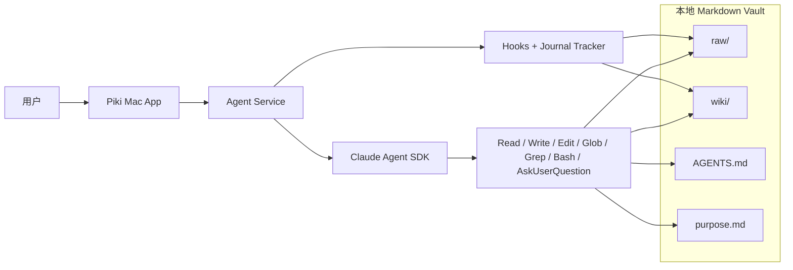

# Piki MVP 功能全景

## 0. MVP 核心判断

Piki MVP 的目标不是做一个“知识库聊天 UI”，而是跑通一个 agent-first 的本地知识维护闭环：

```text
文件/对话输入 -> 统一 agent task -> Claude built-in tools -> raw/wiki 写入 -> journal -> rollback
```

MVP 采用 Claude Agent SDK 作为唯一主 runtime。Piki 不再把 `read_file`、`write_file` 这类自定义工具暴露给 agent，而是直接使用 Claude 内建工具，并通过 hooks、journal 和 staging 保持产品边界。

## 1. MVP 能力地图

| 能力层 | MVP 要支持什么 |
| --- | --- |
| Vault 内核层 | `raw/` + `wiki/` + `AGENTS.md` + `purpose.md` |
| Agent 入口层 | 自然语言、slash command、附件统一进入 `POST /tasks` |
| Runtime 层 | Claude Agent SDK、内建工具、session、partial streaming、AskUserQuestion |
| 安全边界层 | hermetic runtime、vault 内写边界、`AGENTS.md` 只读、Bash 写副作用阻断 |
| Source 层 | inbox、source normalization、staging、source manifest、rescan |
| Wiki 编译层 | source page / concept / entity / domain / synthesis 的增量写入 |
| Journal 层 | 对话级 journal、最近两条 active rollback |
| 维护层 | lint、低风险修复、孤儿页/断链/重复标题检查 |
| 客户端层 | Home 对话、Settings、Recent Activity、状态 rail、输入中断恢复 |

## 2. 运行时架构



## 3. Claude Runtime 在 MVP 中的角色

| 能力 | 说明 |
| --- | --- |
| Agent loop | 推进会话、决定下一步读取/编辑/提问动作 |
| Built-in tools | 直接使用 `Read`、`Write`、`Edit`、`Glob`、`Grep`、`Bash`、`AskUserQuestion` |
| Session | 支持多轮连续上下文和任务恢复 |
| Streaming | 将文本 delta、tool use、暂停事件映射为 Piki SSE 事件 |
| Hooks | 在写入前后执行业务边界和审计 |
| Checkpointing | 作为内部能力可用，但不直接替代 Piki journal 对外暴露 |

Piki 自己负责的部分：

- vault 协议与上下文信封
- hooks 和写入边界
- journal / rollback
- staging 和系统文件维护
- UI 事件协议与状态渲染

## 4. MVP 中不再做的事

- 不再让 agent 依赖 Piki 自定义 `function_tool`
- 不再把 OpenAI runtime 作为兼容主路径
- 不再把普通 `/tasks` 静默降级到旧 query fallback
- 不再把底层事件名直接暴露为 UI 文案
- 不再让 Claude 默认读取仓库 `.claude/` 或 `~/.claude` 记忆

## 5. 统一任务模型

所有主对话入口请求都走同一个任务模型：

1. 创建 task
2. 装配上下文：
   - `AGENTS.md`
   - `purpose.md`
   - `wiki/index.md`
   - `action_context`
   - 最近对话
   - `selected_paths` 对应的 staging manifest
3. 启动 Claude session
4. 流式发布：
   - `agent.run.started`
   - `message.delta`
   - `tool.started`
   - `tool.finished`
   - `agent.input_requested`
   - `journal.created`
   - `task.completed` / `task.failed`
5. 如需用户输入，则暂停并等待 `POST /tasks/{id}/input`

## 6. Source 与写入策略

MVP 仍保留少量确定性系统工作流，但原则发生了变化：

- source normalization、manifest、queue、rollback 仍由服务端系统代码维护
- 语义判断、页面选择、内容组织、是否写入由 agent 决定
- agent 如需做结构化提取，应通过 `Bash` 调用本地 CLI helper

当前推荐的 Bash helper：

- `python -m agent_service.runtime.cli lint`
- `python -m agent_service.runtime.cli extract-source`

真正的 vault 落盘仍通过 `Write/Edit` 完成。

## 7. UI 可观察性

MVP 不展示隐藏推理链，只展示可观察工作流：

- 文本流式输出
- 工具开始/结束
- checklist / todo rail
- AskUserQuestion 暂停
- journal 创建
- task 完成或失败

建议的阶段文案包括：

- `正在理解请求`
- `正在读取知识库`
- `正在整理资料`
- `正在写入知识库`
- `正在记录变更`
- `等待你的输入`
- `已完成`

## 8. MVP 验收重点

- 未配置 `ANTHROPIC_API_KEY` 时，runtime 明确不可用，任务明确失败
- `Write/Edit` 修改 `wiki/*` 成功并创建 journal
- 修改 `AGENTS.md` 被拒绝
- Bash 写副作用命令被拒绝
- `AskUserQuestion` 可暂停并恢复同一 session
- 多轮任务可沿用 Claude session
- Home/Settings 使用 provider-neutral 文案
