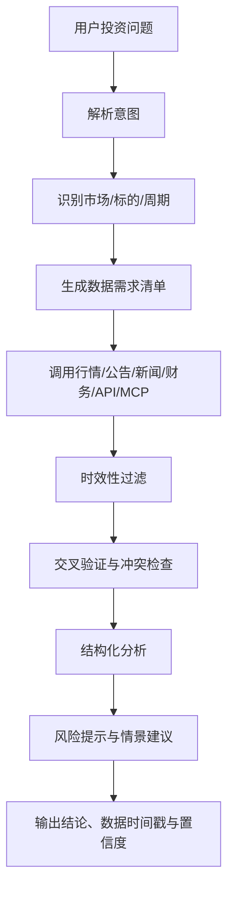

# A股投资研究 Agent 方案文档

## 1. 项目概述

本文档用于沉淀一个面向 A 股场景的投资研究 Agent 方案。项目定位是投资研究与决策辅助，而不是自动荐股系统或自动交易系统。

该 Agent 的核心目标是：根据用户提出的投资问题，自动识别市场、标的、决策周期和信息时效要求，调用行情、公告、财务、新闻、资金流、行业、宏观等数据源，生成结构化投资分析、风险解释和非保证性的情景建议。

允许输出类似“偏积极”“中性”“谨慎”“不建议追高”这样的判断，但每个结论都必须绑定依据、风险边界、数据时间范围和置信度。

## 2. 产品定位

### 2.1 定位描述

一句话定位：

> 一个带有强时效约束的 A 股投资研究 Agent：先判断当前时间和决策周期，再调用行情、公告、新闻、财务和行业数据，只在有效信息窗口内形成分析，并输出带依据、风险和置信度的投资辅助建议。

### 2.2 价值主张

相较于普通问答式投研助手，本项目的差异化重点在于：

- 强时间感知：先判断当前市场时段，再决定分析方式。
- 强周期识别：不同投资问题调用不同信息窗口。
- 强时效约束：只在有效时窗内使用数据形成主要判断。
- 强证据链输出：所有结论都要能回溯到具体事实和时间戳。

### 2.3 边界定义

本项目应该做：

- 投资信息聚合
- 投资研究解释
- 决策辅助分析
- 风险提示
- 情景推演

本项目不应在 MVP 阶段做：

- 自动交易
- 自动下单
- 账户托管
- 一键买卖
- 高频策略执行
- 无依据的确定性荐股

## 3. 核心设计原则

### 3.1 当前时间感知是必选项

每次执行分析前，必须先获取以下上下文：

```text
current_datetime
timezone
market_status
last_trading_day
next_trading_day
```

对于中国股票市场，默认时区为 `Asia/Shanghai`。

`market_status` 至少应覆盖以下状态：

```text
盘前
早盘
午间休市
午后
收盘后
非交易日
```

这是整个系统成立的前提，因为同一个问题在不同时间点代表的真实需求不同。

| 用户问题 | 盘中理解 | 收盘后理解 |
| --- | --- | --- |
| 今天还能买吗 | 需要实时行情、盘口、资金流、涨跌幅、成交量 | 只能分析收盘结构和次日风险 |
| 这票为什么涨 | 需要分钟行情、实时新闻、异动原因 | 需要复盘公告、龙虎榜、板块联动 |
| 适合长期持有吗 | 实时行情权重降低 | 财务、估值、行业、管理层、竞争格局权重提高 |

### 3.2 决策周期必须先识别

Agent 不应该对所有问题使用同一套分析模板。首先要判断用户问题属于哪种决策周期，再决定需要调哪些数据。

| 决策周期 | 典型问题 | 信息窗口 |
| --- | --- | --- |
| 超短线 / 盘中 | 现在能不能追、今天为什么涨停 | 实时到当天 |
| 短线 / 波段 | 这周还能不能看、未来几天怎么看 | 1 到 5 个交易日 |
| 事件驱动 | 公告后会怎样、业绩预告影响大吗 | 公告发布时间前后 1 到 7 天 |
| 中期配置 | 这个行业最近有没有机会 | 7 到 30 天 |
| 长期基本面 | 能不能长期拿 | 最新财报加近期公告加行业趋势 |

默认规则建议写死：

```text
如果用户未说明决策周期，先根据语义推断；
如果无法推断，则默认短线问题使用 3 个交易日窗口；
基本面问题使用最近一期财报 + 近 30 天公告/新闻。
```

### 3.3 Freshness Policy 必须刚性执行

这是项目最关键的规则之一。

#### Freshness Policy

```text
1. 所有实时/短线判断必须基于当前交易日或最近一个交易日数据。
2. 所有新闻/公告必须标注发布时间。
3. 超出决策周期的信息只能作为背景，不得作为主要买卖依据。
4. 如果关键数据过期、缺失或接口失败，必须输出“不足以形成判断”，不得编造。
5. 财报、估值、行业地位这类低频信息可以使用最新一期可得数据，但必须标注报告期。
```

短线分析的可用范围：

```text
可使用：今日分时、涨跌幅、成交额、资金流、板块涨幅、近 1-3 日公告/新闻
不可主要依赖：半年前研报、老财报、长期故事
```

长期分析的可用范围：

```text
可使用：最新年报/季报、近 30-90 天公告、估值分位、行业景气
实时价格只作为买入位置和风险提示
```

## 4. 用户问题处理流程

推荐采用如下分析流水线：



其中最关键的环节是：

- 时效性过滤：确保只使用在当前决策窗口内有效的数据。
- 交叉验证：避免单一来源误报、旧消息误判、传闻驱动结论。

## 5. 输出结构规范

为了保证可信度和稳定体验，建议 Agent 输出固定结构：

```text
1. 结论摘要
2. 当前时间与市场状态
3. 使用的数据范围
4. 核心事实
5. 多维分析
6. 情景判断
7. 操作建议
8. 风险提示
9. 数据来源与更新时间
```

其中第 5 部分建议固定展开为：

```text
- 行情表现
- 资金与成交
- 板块/行业联动
- 公告/新闻催化
- 基本面/估值
```

其中第 6 部分建议固定展开为：

```text
- 偏乐观场景
- 中性场景
- 风险场景
```

其中第 7 部分建议使用约束型表达，而不是指令型表达，例如：

```text
不追高
等回调观察
分批跟踪
仅适合高风险短线
若关键数据缺失则暂不判断
```

## 6. 需求拆解

### 6.1 基础能力

- 识别用户问题中的市场、标的、行业、题材、时间范围
- 推断决策周期
- 获取当前时间与市场状态
- 按周期生成所需数据清单
- 调用多源数据
- 进行时效过滤
- 输出结构化研究结果

### 6.2 分析能力

- 个股短线异动分析
- 公告事件影响分析
- 板块与题材机会分析
- 中长期基本面研究
- 风险事件识别
- 情景分支推演

### 6.3 系统约束

- 数据不足时允许拒答或降级输出
- 不能基于过期新闻形成主结论
- 不能把未验证传闻当作事实
- 必须标注核心数据的时间范围
- 必须输出风险边界

## 7. 数据源分层建议

## 7.1 第一层：MVP 阶段优先接入

### 1. AKShare

定位：MVP 阶段的核心免费数据源。

适合接入的数据类型：

```text
A股实时行情
个股历史行情
指数行情
板块行情
资金流
龙虎榜
财务指标
估值指标
宏观数据
基金/ETF 数据
```

优点：

```text
免费
Python 友好
覆盖广
适合快速原型
```

风险：

```text
部分数据来自公开网页聚合
存在稳定性、频率限制、字段变更风险
不适合高稳定性生产级投顾系统直接依赖
```

### 2. TuShare Pro

定位：A 股结构化数据主干。

适合接入的数据类型：

```text
股票基础信息
日线行情
分钟行情
复权因子
财务报表
每日指标
停复牌
股东数据
资金流
概念/行业
宏观数据
```

优点：

```text
结构化程度高
字段清晰
适合长期数据层和因子分析
```

风险：

```text
很多接口依赖积分或权限
实时性和高频能力受具体权限影响
```

### 3. Baostock

定位：历史 K 线和基础历史数据补充源。

适合接入的数据类型：

```text
历史行情
回测数据
基础 K 线
指数历史数据
```

优点：

```text
简单
免费
适合教学、回测和 MVP
```

风险：

```text
不适合作为强实时分析主数据源
```

## 7.2 第二层：公告、信披与监管信息

### 4. 巨潮资讯 / CNINFO

定位：A 股公告分析核心数据源。

适合接入的数据类型：

```text
上市公司公告
年报/季报/半年报
业绩预告
重大资产重组
股东大会
分红派息
风险提示公告
监管问询函
```

该模块非常关键，因为 A 股短期异动往往由以下事件驱动：

```text
业绩预告
重大合同
并购重组
减持
回购
监管问询
停复牌
ST 风险
```

### 5. 上交所 / 深交所官方数据

定位：权威校验源和规则类信息源。

适合接入的数据类型：

```text
官方交易日历
上市公司公告入口
市场统计数据
行情许可数据
交易规则
停复牌信息
指数相关信息
```

MVP 阶段不一定直接接入收费行情，但建议作为权威校验来源保留。

## 7.3 第三层：商业级数据源

### 6. Wind API

适用场景：

```text
专业投研
机构级数据
资讯舆情
深度财务
一致预期
高质量宏观
多资产数据
```

优点：

```text
数据质量高
覆盖广
机构认可度高
```

缺点：

```text
成本高
授权复杂
```

### 7. 东方财富 Choice

适用场景：

```text
A股基本面
财务数据
行情序列
宏观数据
行业数据
基金数据
债券数据
```

优点：

```text
东方财富生态强
适合中国市场投研
对个人和中小团队可能更易接受
```

### 8. 同花顺 iFinD / Quant API

适用场景：

```text
实时行情
宏观经济
行业数据
问财类自然语言检索
高频序列
板块成分
特色指标
```

优点：

```text
对 A 股生态友好
自然语言检索能力适合和 LLM 结合
```

## 7.4 第四层：交易与实盘相关能力

### 9. MiniQMT / XtQuant

适合能力：

```text
实时行情订阅
本地量化交易
券商账户交易
持仓查询
委托
撤单
成交回报
```

结论：

```text
不建议在 MVP 阶段接入
```

原因是它会把产品从分析辅助推向交易执行，显著提升合规、风控和误操作成本。

## 8. 可参考的 MCP 方向

目前已有一些围绕中国股票市场数据的 MCP 项目，可以作为参考架构或封装方向。

### 8.1 Chinese Stock Market Data MCP

可参考能力：

```text
AkShare + Tushare
FastAPI Server
Redis Cache
实时行情
基本面
新闻监控
市场可视化
```

### 8.2 TuShare Financial Data MCP

可参考能力：

```text
Tushare MCP wrapper
A股行情
概念板块
资金流
分钟线
```

### 8.3 akshare-one-mcp

可参考能力：

```text
免费数据 MVP
历史数据
实时数据
新闻数据
财务报表
快速接入 Agent
```

### 8.4 AKShare MCP Server

可参考能力：

```text
通过 MCP 访问中国及全球金融数据
股票、基金、债券、期货、外汇、宏观数据查询
```

## 9. 推荐技术选型

### 9.1 MVP 阶段

最推荐的方案：

```text
AKShare MCP
+ TuShare Pro MCP
+ 巨潮公告抓取/接口
+ Web Search 新闻源
+ 自建 freshness filter
+ 自建 investment analysis orchestration
```

选择原因：

```text
AKShare 覆盖广，适合快速起步
TuShare 结构化好，适合承担主数据层
巨潮公告保证 A 股事件分析质量
Web Search 适合补充最新新闻与政策
```

### 9.2 专业版阶段

可升级为：

```text
Wind / Choice / iFinD
+ CNINFO Data Service
+ 交易所官方数据
+ 新闻舆情 API
+ 自建因子库
+ 自建事件库
```

适合面向商业化、专业投资者或机构客户。

## 10. 工具能力设计建议

虽然当前阶段重点是落方案文档，但从工程拆解看，后续数据能力建议围绕以下函数组织：

```text
get_current_time()
get_market_status()
get_stock_realtime_quote(symbol)
get_stock_intraday(symbol)
get_stock_recent_kline(symbol, window)
get_stock_money_flow(symbol, window)
get_sector_performance(window)
get_related_sector(symbol)
get_company_announcements(symbol, start_time, end_time)
get_company_financials(symbol, latest_period)
get_valuation_metrics(symbol)
get_news(query, start_time, end_time)
get_macro_events(start_time, end_time)
get_risk_events(symbol, window)
```

设计原则：

- 工具层只负责取数和标准化
- 分析层负责时效过滤、交叉验证和结论组织
- 用户不直接调用底层工具，由 Agent 自动规划调用

## 11. 分析规则建议

建议把以下规则当作系统级硬约束：

```text
1. 你是投资研究辅助系统，不是自动荐股系统。
2. 每次分析前必须先获取当前时间。
3. 每次分析前必须判断市场状态。
4. 每次分析前必须判断用户问题对应的决策周期。
5. 必须生成数据时效窗口。
6. 只使用窗口内的新闻、行情、公告作为主要依据。
7. 对财报、估值、股东结构等低频数据，使用最新可得版本，并标注报告期。
8. 如果实时数据缺失，必须明确说明。
9. 不得基于过期新闻或未验证传闻给出确定性结论。
10. 输出必须包含数据来源、更新时间、风险提示和置信度。
```

## 12. 产品形态建议

### 12.1 快速问答模式

示例问题：

```text
帮我看下比亚迪今天为什么跌
```

建议输出：

```text
当前时间
行情表现
板块表现
资金流
最新新闻/公告
可能原因排序
短线风险
```

### 12.2 标的研究模式

示例问题：

```text
帮我分析一下宁德时代适不适合中长期持有
```

建议输出：

```text
公司基本面
行业趋势
估值
最新财报
近期公告
机构预期
风险
中长期情景判断
```

### 12.3 投资机会扫描模式

示例问题：

```text
最近 3 天 A 股有什么值得关注的 AI 方向机会
```

建议输出：

```text
板块热度
涨幅排行
资金流
新闻催化
政策事件
相关标的池
风险排序
不建议无脑追高
```

## 13. MVP 范围建议

建议首版只聚焦以下能力：

- A 股个股问答分析
- 板块/题材短线机会分析
- 公告事件影响解读
- 中长期基本面分析
- 基于时效窗口的结构化输出

建议暂缓：

- 自动交易
- 账户接入
- 自建高频策略
- 多市场联动交易执行
- 复杂个性化组合管理

## 14. 风险与合规提醒

该项目在产品表达和系统行为上都应明确以下边界：

- 提供的是研究辅助，不是收益承诺
- 输出的是情景建议，不是确定性买卖指令
- 结论必须带有风险说明
- 数据缺失时应拒绝强判断
- 不能以传闻、未证实截图、旧消息构造结论

建议在产品层增加统一免责声明，避免把研究工具包装成自动投顾或荐股工具。

## 15. 结论

这个项目最值得做的，不是“替用户直接下结论”，而是“把结论建立在明确的时间、周期、数据窗口和风险边界上”。

因此，MVP 最优先的建设方向不是交易执行，而是：

```text
AKShare + TuShare Pro + 巨潮公告 + Web Search + 自建 MCP wrapper + 自建 freshness filter
```

如果后续进入商业化和专业化阶段，再逐步引入：

```text
Wind / Choice / iFinD / CNINFO Data Service / 交易所授权行情
```

从产品路线看，先把“时效性正确的投研分析”做好，比过早做“自动交易”更重要。

## 16. 参考资料

[1]: https://akshare.akfamily.xyz/introduction.html?utm_source=chatgpt.com "AKShare 项目概览— AKShare 1.18.64 文档"
[2]: https://tushare.pro/document/2?utm_source=chatgpt.com "沪深股票"
[3]: https://www.baostock.com/?utm_source=chatgpt.com "Baostock"
[4]: https://webapi.cninfo.com.cn/?utm_source=chatgpt.com "深证信数据服务平台 CNINFO Data Service"
[5]: https://www.sse.com.cn/services/tradingtech/data/?utm_source=chatgpt.com "技术接口 | 上海证券交易所"
[6]: https://www.wind.com.cn/mobile/WDS/sapi/zh.html?utm_source=chatgpt.com "数据接口服务"
[7]: https://quantapi.eastmoney.com/?utm_source=chatgpt.com "Choice 数据量化接口"
[8]: https://quantapi.10jqka.com.cn/?utm_source=chatgpt.com "同花顺数据接口"
[9]: https://dict.thinktrader.net/nativeApi/code_examples.html?utm_source=chatgpt.com "完整实例"
[10]: https://www.pulsemcp.com/servers/huweihua123-chinese-stock-market?utm_source=chatgpt.com "Chinese Stock Market Data (AkShare & Tushare)"
[11]: https://www.pulsemcp.com/servers/hanxuanliang-tushare-financial-data?utm_source=chatgpt.com "TuShare Financial Data MCP"
[12]: https://github.com/zwldarren/akshare-one-mcp?utm_source=chatgpt.com "akshare-one-mcp"
[13]: https://mcpmarket.com/server/akshare?utm_source=chatgpt.com "AKShare MCP Server"
